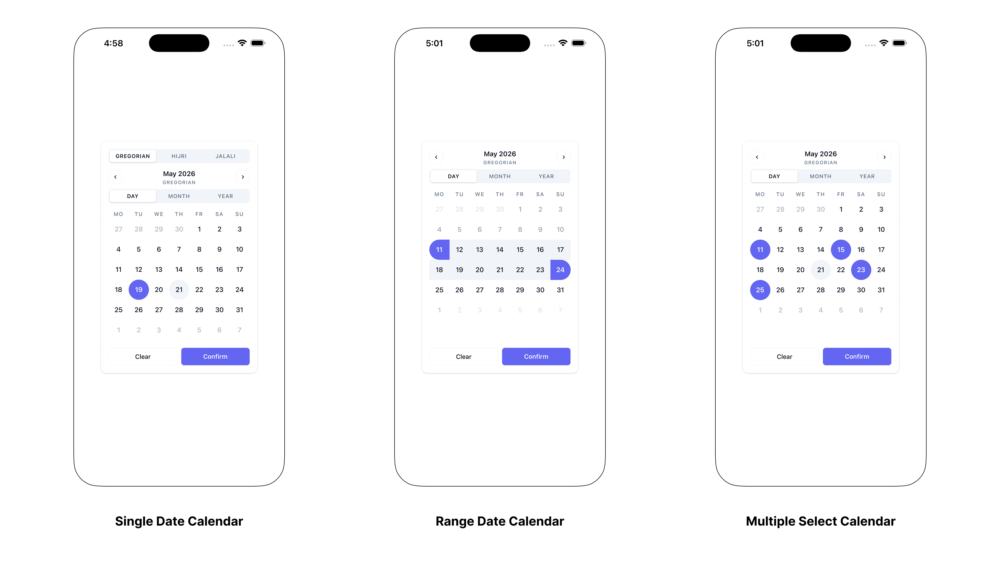
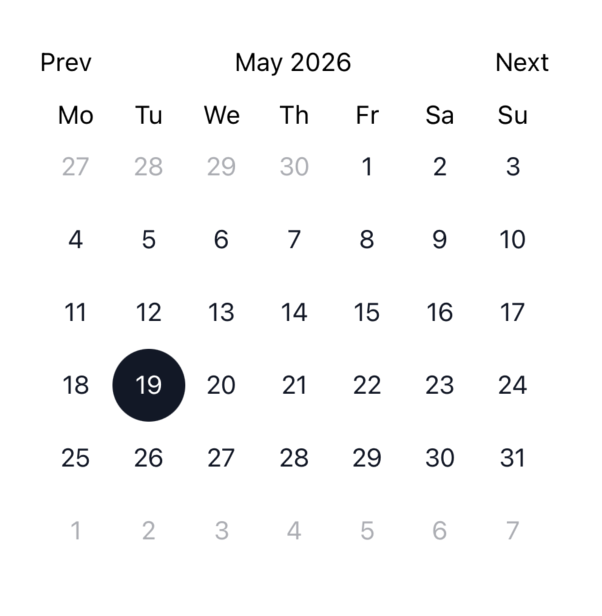
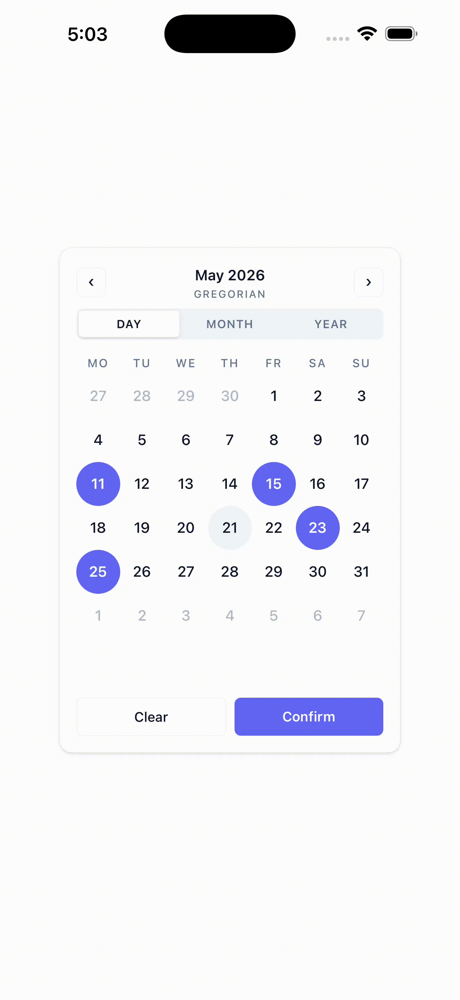
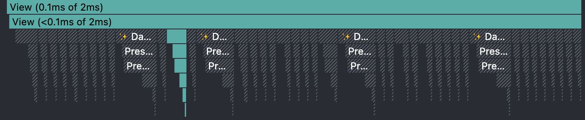

# react-native-headless-calendar

Build your own React Native calendar without rebuilding calendar logic.

`react-native-headless-calendar` gives you typed providers, tiny selector hooks, fast date-grid state, and calendar-system adapters for Gregorian, Hijri, Jalali, or your own system. You bring the UI. The library handles selection, navigation, bounds, disabled days, modifiers, payloads, and re-render control.

**[Documentation](https://mahmoudkarout.github.io/react-native-headless-calendar/)** · **[Example app](./example)** · **[Contributing](./CONTRIBUTING.md)**

> [!WARNING]
> This library is currently in beta. APIs are still subject to breaking changes before a stable release.



## Why developers reach for it

- **Headless by design**: no shipped chrome, no theme object to fight, no fixed layout.
- **Three explicit modes**: single date, date range, and multiple dates each have their own provider and typed hooks.
- **Fast cell updates**: day cells subscribe to exactly the state they read through `useSyncExternalStore`.
- **Calendar-system ready**: Gregorian is built in; Hijri and Jalali are opt-in sub-paths.
- **Friendly escape hatches**: disabled rules, custom modifiers, bounds, grid utilities, month/year views, and custom calendar systems.

Works with **iOS**, **Android**, and **React Native Web**.

## Install

```bash
yarn add react-native-headless-calendar
```

```bash
npm install react-native-headless-calendar
```

Peer requirements:

| Peer           | Minimum    |
| -------------- | ---------- |
| `react`        | `>=18.0.0` |
| `react-native` | `>=0.70.0` |

Optional calendar-system peers:

| System | Install                              | Import                                          |
| ------ | ------------------------------------ | ----------------------------------------------- |
| Hijri  | `yarn add @tabby_ai/hijri-converter` | `react-native-headless-calendar/systems/hijri`  |
| Jalali | `yarn add moment-jalaali`            | `react-native-headless-calendar/systems/jalali` |

## 60-second calendar

The library exposes state. Your components decide how it looks.



```tsx
import { memo, useCallback } from 'react';
import { Pressable, Text, View } from 'react-native';
import {
  SingleDateProvider,
  selectSingleDays,
  useSingleCalendarActions,
  useSingleCalendarSelector,
  type SingleDayCellInfo,
} from 'react-native-headless-calendar';

export function Calendar() {
  return (
    <SingleDateProvider onChange={(selection) => console.log(selection.date)}>
      <View style={{ gap: 12 }}>
        <CalendarHeader />
        <Weekdays />
      </View>
      <Days />
    </SingleDateProvider>
  );
}

function CalendarHeader() {
  const title = useSingleCalendarSelector(
    (s) => s.days.displayedMonthLabel + ' ' + s.days.displayedYearLabel
  );
  const { goPrevMonth, goNextMonth } = useSingleCalendarActions();

  return (
    <View
      style={{
        flexDirection: 'row',
        justifyContent: 'space-between',
        width: 280,
      }}
    >
      <Pressable onPress={goPrevMonth}>
        <Text>Prev</Text>
      </Pressable>
      <Text>{title}</Text>
      <Pressable onPress={goNextMonth}>
        <Text>Next</Text>
      </Pressable>
    </View>
  );
}

function Weekdays() {
  const labels = useSingleCalendarSelector((s) => s.days.weekdayLabels);

  return (
    <View style={{ flexDirection: 'row' }}>
      {labels.map((label) => (
        <Text key={label} style={{ width: 40, textAlign: 'center' }}>
          {label.slice(0, 2)}
        </Text>
      ))}
    </View>
  );
}

function Days() {
  const days = useSingleCalendarSelector(selectSingleDays);
  const { selectDate } = useSingleCalendarActions();

  const onPress = useCallback(
    (cell: SingleDayCellInfo) => selectDate(cell.date),
    [selectDate]
  );

  return (
    <View style={{ flexDirection: 'row', flexWrap: 'wrap', width: 280 }}>
      {days.cells.map((cell) => (
        <DayCell
          key={cell.nativeDate.toISOString()}
          cell={cell}
          onPress={onPress}
        />
      ))}
    </View>
  );
}

const DayCell = memo(function DayCell({
  cell,
  onPress,
}: {
  cell: SingleDayCellInfo;
  onPress: (cell: SingleDayCellInfo) => void;
}) {
  return (
    <Pressable
      disabled={cell.isDisabled}
      onPress={() => onPress(cell)}
      style={{
        width: 40,
        height: 40,
        alignItems: 'center',
        justifyContent: 'center',
        opacity: cell.isCurrentMonth ? 1 : 0.35,
        backgroundColor: cell.isSelected ? '#111827' : 'transparent',
        borderRadius: 20,
      }}
    >
      <Text style={{ color: cell.isSelected ? 'white' : '#111827' }}>
        {cell.label}
      </Text>
    </Pressable>
  );
});
```

That is the core mental model:

1. Wrap your UI in a mode-specific provider.
2. Read small pieces of state with a selector hook.
3. Trigger changes with an actions hook.
4. Render every pixel yourself.

## Selection modes

Choose the provider that matches the product behavior. No `mode` prop, no runtime guessing.

| Use case           | Provider               | Read hook                     | Action hook                  |
| ------------------ | ---------------------- | ----------------------------- | ---------------------------- |
| One date           | `SingleDateProvider`   | `useSingleCalendarSelector`   | `useSingleCalendarActions`   |
| Start and end date | `RangeDateProvider`    | `useRangeCalendarSelector`    | `useRangeCalendarActions`    |
| Many dates         | `MultipleDateProvider` | `useMultipleCalendarSelector` | `useMultipleCalendarActions` |

Range mode adds `initialStart`, `initialEnd`, `allowSameDay`, `minRangeDays`, `maxRangeDays`, and `disabledInRangeBehavior`.

Multiple mode adds `initialDates` and `maxSelected`.

## Range picker example

```tsx
import {
  RangeDateProvider,
  selectRangeDays,
  useRangeCalendarActions,
  useRangeCalendarSelector,
} from 'react-native-headless-calendar';

function BookingCalendar() {
  return (
    <RangeDateProvider
      minDate={new Date()}
      allowSameDay
      maxRangeDays={14}
      disabledInRangeBehavior="reject"
      onConfirm={({ gregorianStartDate, gregorianEndDate }) => {
        console.log({ gregorianStartDate, gregorianEndDate });
      }}
    >
      <RangeGrid />
    </RangeDateProvider>
  );
}

function RangeGrid() {
  const days = useRangeCalendarSelector(selectRangeDays);
  const canConfirm = useRangeCalendarSelector(
    (s) => !!s.rangeStart && !!s.rangeEnd
  );
  const { selectDate, confirm } = useRangeCalendarActions();

  return (
    <>
      {days.cells.map((cell) => (
        <Pressable
          key={cell.nativeDate.toISOString()}
          disabled={cell.isDisabled}
          onPress={() => selectDate(cell.date)}
        >
          <Text>
            {cell.label}
            {cell.isRangeStart ? ' start' : ''}
            {cell.isRangeEnd ? ' end' : ''}
            {cell.isInRange ? ' in range' : ''}
          </Text>
        </Pressable>
      ))}

      <Pressable disabled={!canConfirm} onPress={confirm}>
        <Text>Confirm</Text>
      </Pressable>
    </>
  );
}
```

## Built for quiet performance

Selecting a day re-renders only the cells whose state changed. The rest of the grid keeps its identity.





What makes that work:

- `use*CalendarSelector` subscribes through `useSyncExternalStore`.
- `use*CalendarActions` returns stable functions and does not subscribe.
- `days.cells` reuse object identity for unchanged cells.
- `React.memo` day cells can skip untouched dates naturally.

Rule of thumb: components that only call actions should use `use*CalendarActions`; components that render state should use the selector hook.

## Calendar systems

Gregorian is available from the root export. Hijri and Jalali are optional sub-paths so apps only install what they use.

```tsx
import {
  SingleDateProvider,
  gregorianSystem,
} from 'react-native-headless-calendar';
import { hijriSystem } from 'react-native-headless-calendar/systems/hijri';
import { jalaliSystem } from 'react-native-headless-calendar/systems/jalali';

export function MultiSystemCalendar() {
  return (
    <SingleDateProvider
      systems={[gregorianSystem, hijriSystem, jalaliSystem]}
      activeSystemId="hijri"
    >
      <MyCalendar />
    </SingleDateProvider>
  );
}
```

Switch at runtime with `setActiveSystem(id)`:

```tsx
function SystemSwitch() {
  const { setActiveSystem } = useSingleCalendarActions();

  return (
    <View>
      <Pressable onPress={() => setActiveSystem('gregorian')}>
        <Text>Gregorian</Text>
      </Pressable>
      <Pressable onPress={() => setActiveSystem('hijri')}>
        <Text>Hijri</Text>
      </Pressable>
      <Pressable onPress={() => setActiveSystem('jalali')}>
        <Text>Jalali</Text>
      </Pressable>
    </View>
  );
}
```

Selections and bounds are carried across systems by absolute native `Date`, while labels and date parts come from the active system.

## Disabled dates and modifiers

Use bounds, explicit dates, ranges, predicates, and named modifiers to keep product rules close to the provider.

```tsx
<SingleDateProvider
  minDate="2026-01-01"
  maxDate="2026-12-31"
  disabledDates={['2026-02-14']}
  disabledRanges={[{ start: '2026-04-01', end: '2026-04-05' }]}
  disabled={(date) => date.getDay() === 0}
  modifiers={{
    weekend: (date) => date.getDay() === 5 || date.getDay() === 6,
    payday: ['2026-01-31', '2026-02-28'],
  }}
>
  <MyCalendar />
</SingleDateProvider>
```

Each day cell receives:

```ts
cell.isDisabled;
cell.modifiers.weekend;
cell.modifiers.payday;
```

For ranges that cross disabled interior days, `disabledInRangeBehavior` controls the result:

| Value     | Behavior                                                              |
| --------- | --------------------------------------------------------------------- |
| `reject`  | Ignore the second tap and keep the current `rangeStart`.              |
| `include` | Store the full range; disabled interior cells remain marked disabled. |
| `exclude` | Clamp `rangeEnd` to the day before the first disabled interior day.   |

## API map

### Providers

| Provider               | Initial selection props      | Extra props                                                               |
| ---------------------- | ---------------------------- | ------------------------------------------------------------------------- |
| `SingleDateProvider`   | `initialDate`                | -                                                                         |
| `RangeDateProvider`    | `initialStart`, `initialEnd` | `allowSameDay`, `minRangeDays`, `maxRangeDays`, `disabledInRangeBehavior` |
| `MultipleDateProvider` | `initialDates`               | `maxSelected`                                                             |

Shared provider props:

`systems`, `activeSystemId`, `minDate`, `maxDate`, `disabledDates`, `disabledRanges`, `disabled`, `modifiers`, `firstDayOfWeek`, `onChange`, `onConfirm`, `onClear`.

`firstDayOfWeek` uses `0` for Sunday through `6` for Saturday and defaults to Monday (`1`).

### Selectors

| Single                   | Range                   | Multiple                   |
| ------------------------ | ----------------------- | -------------------------- |
| `selectSingleDays`       | `selectRangeDays`       | `selectMultipleDays`       |
| `selectSingleMonths`     | `selectRangeMonths`     | `selectMultipleMonths`     |
| `selectSingleYears`      | `selectRangeYears`      | `selectMultipleYears`      |
| `selectSingleCanConfirm` | `selectRangeCanConfirm` | `selectMultipleCanConfirm` |

Every mode also supports inline selectors:

```tsx
const monthLabel = useSingleCalendarSelector((s) => s.days.displayedMonthLabel);
```

### Actions

Each mode exposes the same action names:

```ts
selectDate(input);
clear();
confirm();
goPrevMonth();
goNextMonth();
setDisplayedDate(input);
selectMonth(index);
selectYear(year);
prevYearPage();
nextYearPage();
setActiveSystem(id);
isConfirmable();
```

### Selection payloads

Callbacks receive native `Date` values plus active-system date parts and `systemId`.

```ts
type SingleSelectionPayload = {
  gregorianDate: Date | undefined;
  systemId: string;
  system: DateParts | undefined;
};
```

Range and multiple payloads follow the same idea with start/end or date arrays.

## Advanced building blocks

The package exports grid utilities for custom layouts and tests:

```ts
import {
  buildMonthGrid,
  getYearPage,
  isBetween,
  isoWeekNumber,
  matchDate,
  rotateWeekdayLabels,
} from 'react-native-headless-calendar';
```

You can also implement `CalendarSystem<T>` to support another calendar. A system controls parsing, month math, labels, comparison, formatting, and conversion to/from native `Date`.

## Example app

The example app includes single, range, and multiple calendars with day, month, year, and system-switching views.

```bash
yarn
yarn example start
```

## Documentation

- [Installation](https://mahmoudkarout.github.io/react-native-headless-calendar/docs/installation)
- [Mental model](https://mahmoudkarout.github.io/react-native-headless-calendar/docs/core-concepts/mental-model)
- [Providers](https://mahmoudkarout.github.io/react-native-headless-calendar/docs/hooks/providers)
- [Selectors](https://mahmoudkarout.github.io/react-native-headless-calendar/docs/hooks/selectors)
- [Calendar systems](https://mahmoudkarout.github.io/react-native-headless-calendar/docs/core-concepts/calendar-systems)
- [Custom systems](https://mahmoudkarout.github.io/react-native-headless-calendar/docs/systems/custom-system)

## License

MIT
